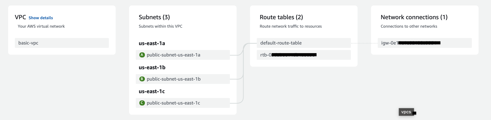
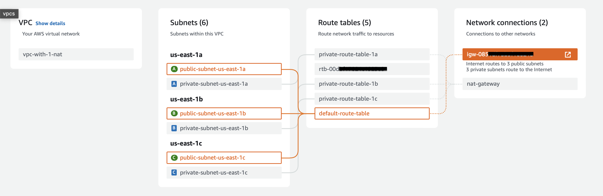
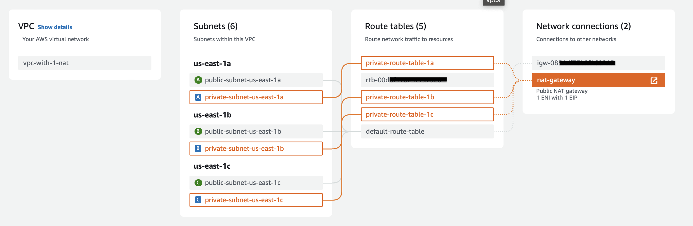
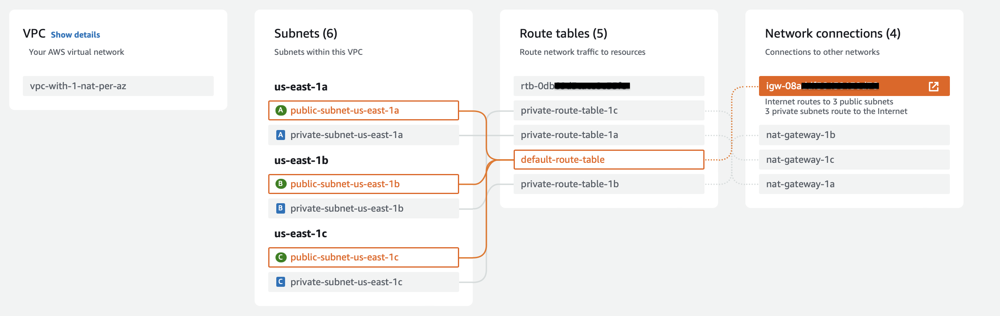
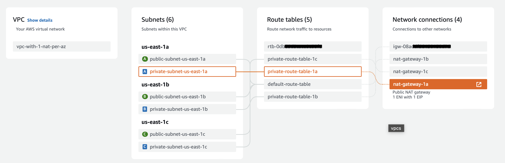

# AWS VPC Architecture patterns

#### What is a VPC?
A Virtual Private Cloud (VPC) in AWS is a logically isolated section of the AWS cloud where you can launch AWS resources in a virtual network that you define. It allows you to control the networking environment of your AWS resources, including IP address ranges, subnets, route tables, and network gateways
###### For more information about AWS VPC, refer to the [AWS VPC documentation](https://docs.aws.amazon.com/vpc/latest/userguide/what-is-amazon-vpc.html)
---

### Comparison of the Three Most Widely Used AWS VPC Architecture Patterns
| | Architecture 1 (Only Public Subnets) | Architecture 2 (Public and Private Subnets + Single NAT Gateway) |  Architecture 3 (Public and Private Subnets + 1 NAT Gateway per AZ) |
| :-----: | :-----: | :---: | :---: |
| **Security** | :x: | :white_check_mark:   | :white_check_mark:   |
| **Reliability** | :white_check_mark: | :x:   | :white_check_mark:   |
| **Cost** | $ | $$   | $$$   |
| **Use case** | Personal projects | Development environments Early stage startups | Production environments |

---
### :warning: Important: Please read
* **Please note that deploying the CloudFormation templates below may incur some charges. Specifically, Architecture 2 and Architecture 3 will result in additional costs due to the use of NAT Gateways**
* The goal of this comparison is to show different ways to configure a single VPC. I will release another guide soon that covers below
    * Multi VPC architectures & connectivity between them
    * Subnet architectures within a VPC
* This is intended for an audience with basic knowledge of AWS VPC and its components
* The CloudFormation templates provided are designed for the `us-east-1` region. If you want to deploy in another region, review and modify the templates as needed
* To keep things simple, the templates do not accept parameters. Feel free to copy and adjust them if required

---
### VPC Architecture 1: Only Public Subnets
CloudFormation template: [vpc-only-public-subnets.yaml](./cloudformation/vpc-only-public-subnets.yaml)
##### Public Subnet, Route Table, and Internet Gateway

---
### VPC Architecture 2: Public and Private Subnets + Single NAT Gateway
CloudFormation template: [vpc-public-private-subnets-1-nat.yaml](./cloudformation/vpc-public-private-subnets-1-nat.yaml)
##### Public Subnet, Route Table, and Internet Gateway

##### Private Subnet, Route Table, and NAT Gateway

---
### VPC Architecture 3: Public and Private Subnets + 1 NAT Gateway per Availability Zone
CloudFormation template: [vpc-public-private-subnets-1-nat-per-az.yaml](./cloudformation/vpc-public-private-subnets-1-nat-per-az.yaml)
##### Public Subnet, Route Table, and Internet Gateway

##### Private Subnet, Route Table, and NAT Gateway
